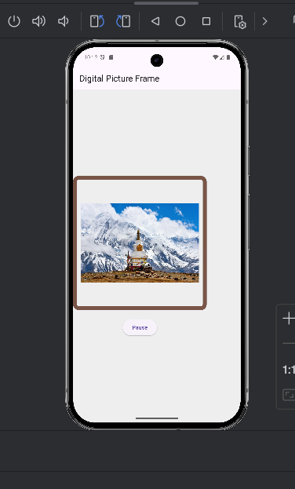

# lab3

A new Flutter project.

## Getting Started

This project is a starting point for a Flutter application.

A few resources to get you started if this is your first Flutter project:

I have used here 4 images which changes in every 10 sec and there is pause and resume button
which can pause and resume the images as we wanted.

Features
-Displays a list of images in a framed container.
- Timer through images changes every 10 sec automatically.
- Allows user to pause and resume the slideshow.
- Uses timer to handle automatic image switching.

Technologies Used
- Flutter
- -Dart
- -Material Design

How to Use
- Launch the app.
- Watch the images change every 10 seconds.
- Press the "Pause" button to stop the slideshow.
- Press "Resume" to continue the slideshow.

Future Enhancements
- Add transition effects between images.
- Allow users to upload their own images.
- Provide a manual navigation option for images.